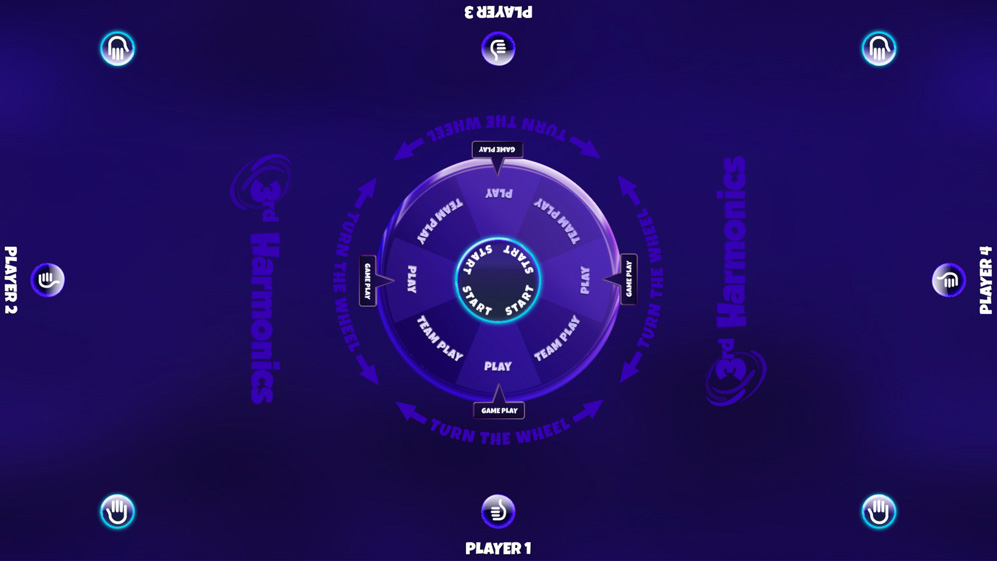
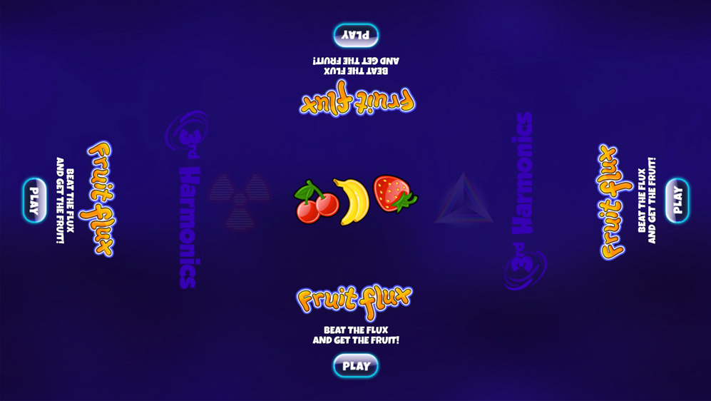

# harmonicsGameEngine

## Table of Contents

[Description](#description) [Demo](#demo) [Usage](#usage) [Contributing](#contributing) [Tests](#tests) [License](#license) [Questions](#questions) 

## Description

Management app for multiplayer game tables.

The app was created as a minimum viable product and has a WordPress backend that facilitates the delivery of games via a tiered subscription system.

A requirement was that the app should run games created in both the [Phaser HTML5 game framework](https://phaser.io/) and [Construct game engine](https://www.construct.net/en). Further, game developers should be able to test locally that their games would interact correctly with the system. This led to the development of [VTAPI](https://github.com/paulashby/harmonicsGameEngine/blob/main/moduleTest/vt-api-1.7.js) to act as a bridge between the game environment and the Harmonics [Game Manager](https://github.com/paulashby/harmonicsGameEngine/blob/main/wp-content/themes/harmonics/scripts/GameManager.js). The incorporation of VTAPI into a [plugin](https://github.com/paulashby/harmonicsGameEngine/tree/main/Construct_2_plugin_1_5/vtapi) allows Construct developers to mock player set ups for testing and to receive appropriate responses in their local environments. No plugin is required for Phaser games, where VTAPI offers the same functionality directly.

While VTAPI and the GameManager manage the flow of data to and from the games, the [startPage](https://github.com/paulashby/harmonicsGameEngine/tree/main/wp-content/startPage/src) provides the user interface, managing player/team configuration, game selection and scores.  

*Start page*  
*Select menu* 

## Demo

You can try out the front end [here](https://harmonics.primitive.co/). Please note that the system was developed for use on game tables with a resolution of 1920 x 1080 pixels, so will appear distorted at other aspect ratios.

## Usage
As the [front end demo](https://harmonics.primitive.co/) shows, the start screen features eight buttons, one at each possible player position. Players join a game by clicking a button. Once a minimum of two players have joined, the 'Start' button appears at the centre of the screen with a disc widget allowing team or individual play to be selected. If team play is selected, an additional widget appears offering the various team set ups available for the current number of players. Up to eight players can join and once ready, press 'Start'. 

The game selection menu now becomes active, allowing players to swipe through the list of available games. When a game is selected, brief instructions are shown (once per session) before gameplay begins. When the game ends, the winning and losing scores are displayed before returning to the start screen where the aggregated scores for the current session are displayed. Players have the option to play again, choose a different game or to change players which effectively takes them back to the start screen.

## Contributing

If you would like to make a contribution to the app, simply fork the repository and submit a Pull Request. If I like it, I may include it in the codebase.

## Tests

N/A

## License

Released under the [MIT](https://opensource.org/licenses/MIT) license.

## Questions

Feel free to [email me](mailto:paul@primitive.co?subject=HarmonicsGameEngine%20query%20from%20GitHub) with any queries. If you'd like to see some of my other projects, my GitHub user name is [paulashby](https://github.com/paulashby).
